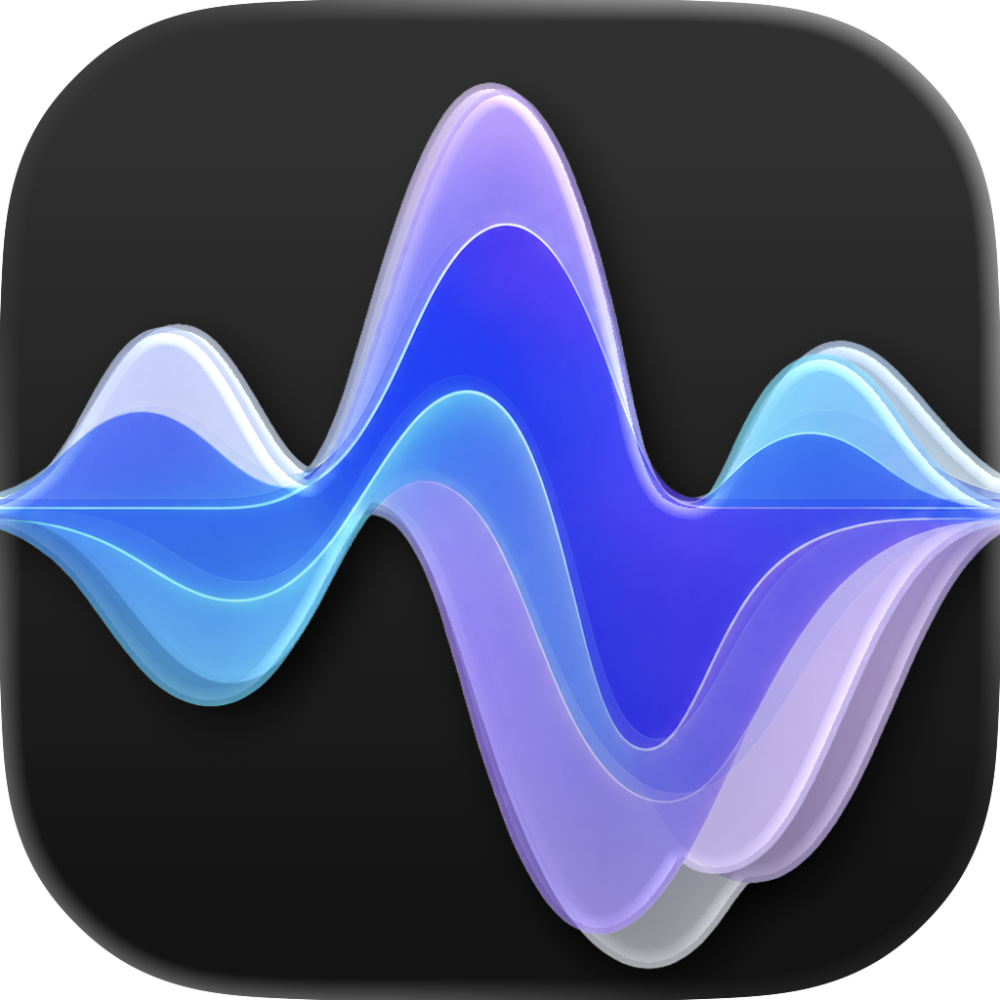

<p align="center">
  
</p>

<h1 align="center">Sotto</h1>

<p align="center">
  Select text in any macOS app, use your shortcut, and hear it read aloud.<br>
  Expressive local text-to-speech with <a href="https://github.com/FluidInference/FluidAudio">FluidAudio</a> and <a href="https://huggingface.co/hexgrad/Kokoro-82M">Kokoro</a>.<br>
  Runs quietly from your menu bar.
</p>

<p align="center">
  <a href="LICENSE"></a>
  
  
</p>

<p align="center">
  <video src="Demo/Sotto_resize.mp4" controls muted loop playsinline width="960" aria-label="Sotto reading selected text from the macOS menu bar"></video>
</p>

<p align="center">
  <a href="https://www.producthunt.com/products/sotto-7?embed=true&amp;utm_source=badge-featured&amp;utm_medium=badge&amp;utm_campaign=badge-sotto-3fb008d4-a845-4f83-9a4f-f5d1a9b03474" target="_blank" rel="noopener noreferrer"></a>
</p>

---

## Requirements

- macOS 15 or later
- Apple silicon Mac recommended
- Xcode 26 or later to build from source
- Internet access for the first FluidAudio dependency resolution and Kokoro download

## Install with Homebrew

```bash
brew install --cask shreysid/tap/sotto
```

The current Homebrew release is an unsigned Apple-silicon preview. If macOS blocks its first launch, open Sotto from Applications once, then choose **Open Anyway** in **System Settings → Privacy & Security**.

## Build from source

1. Clone Sotto:

   ```bash
   git clone https://github.com/Shreysid/Sotto.git
   cd Sotto
   ```

2. Open the project:

   ```bash
   open Sotto.xcodeproj
   ```

3. In Xcode, select the `Sotto` scheme and `My Mac` as the run destination.
4. Press `Cmd+R` to build and run. Xcode resolves FluidAudio through Swift Package Manager on the first build.

## First use

Sotto appears as a waveform in the menu bar. On first launch it asks for Accessibility access, which lets it read the active text selection and respond to your global shortcut.

1. Choose **Open Accessibility Settings** in Sotto's prompt and enable **Sotto**.
2. Download Kokoro from Sotto's first-run prompt.
3. Select text in any app, then press the configured shortcut to start speaking.
4. Use the shortcut again with no selection, or use the stop control, to stop playback.

Kokoro downloads once, stays outside the app bundle, and is loaded locally. Sotto warms it after startup so the first real selection can begin sooner.

## Controls

Click the menu-bar waveform to open playback controls and **Sotto Studio**.

| Setting | What it does |
|---|---|
| **Playback speed** | Uses stepped speed values from `0.75x` to `1.35x`; changes apply during playback. |
| **Global shortcut** | Records the shortcut you want to use for speaking selected text. |
| **Pronunciation** | Replaces a word or phrase with a preferred spoken form before Kokoro synthesizes it. |
| **Pause for voice apps** | Stops Sotto when a supported calling or voice app becomes active. |
| **Stats** | Tracks locally spoken words and total playback time. |

## Privacy

Selected text and generated audio remain on-device. Sotto contacts the model host only to download Kokoro and its supporting assets.

## Credits

- [FluidAudio](https://github.com/FluidInference/FluidAudio) provides the local Apple Silicon inference and model-management layer.
- [Kokoro-82M](https://huggingface.co/hexgrad/Kokoro-82M) provides Sotto's expressive text-to-speech model.

FluidAudio and Kokoro-82M are both licensed under Apache-2.0. See [THIRD_PARTY_NOTICES.md](THIRD_PARTY_NOTICES.md) for attribution details.

## License

[Apache License 2.0](LICENSE)
